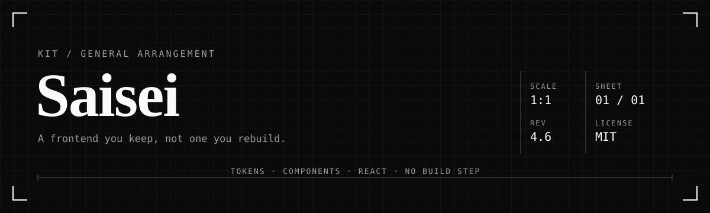
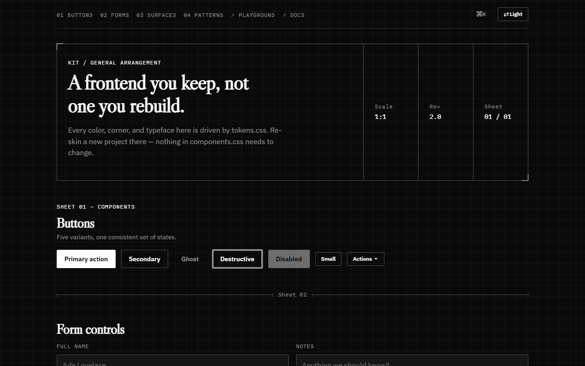
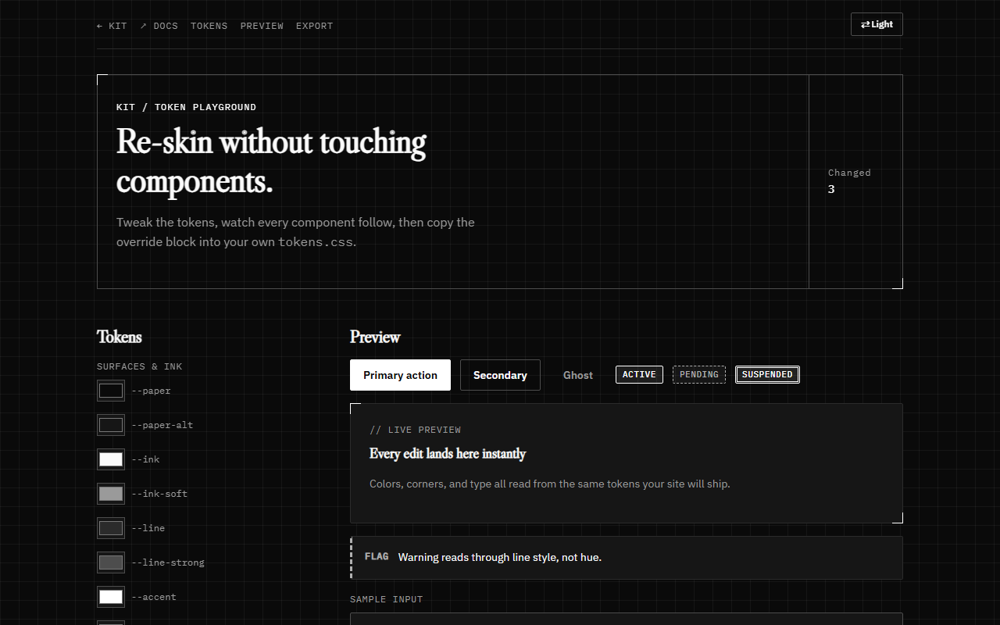
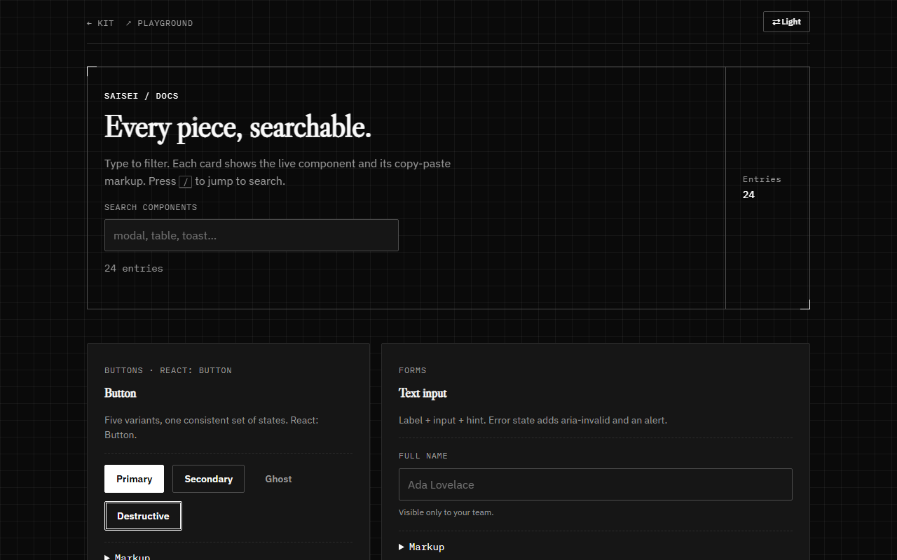
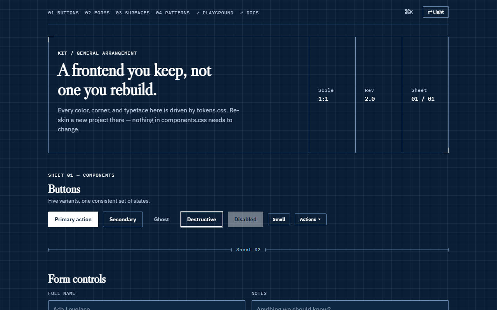

# Saisei — reusable frontend kit (Blueprint design language)

[](https://www.npmjs.com/package/@chomuiro/saisei)
[](https://github.com/syedhaamidk/Saisei/actions)
[](LICENSE)

A drafting/schematic design language, not a generic SaaS kit. Three files, no build step, no framework lock-in.

| Kit catalog | Token playground | Searchable docs |
|---|---|---|
|  |  |  |

- **tokens.css** — every color, font, spacing, and radius value, as CSS variables. This is the only file you should need to touch when starting a new project.
- **components.css** — buttons, forms, cards, badges, alerts, title-block nav, tabs, accordion, modal, toast, table, avatar, skeleton loaders. Reads only from tokens.css.
- **components.js** — vanilla JS that wires up modals, tabs, accordions, and toasts via `data-*` attributes. No dependencies, no build step.

Open `index.html` to see every component and copy markup straight from it. Open `playground.html` to re-skin live, `docs.html` to search the catalog.

## Themes

One-click presets — same values as `themes.json`, built to `dist/theme-<name>.css`:

| Blueprint (default) | Warm | Contrast | Soft | Moss | Slate | Blueprint-blue |
|---|---|---|---|---|---|---|
|  |  |  |  |  |  |  |



## Reuse in any website

Two files carry the whole kit. Pick one path:

**A — Copy files (simplest, no npm).** Copy `dist/blueprint.css` + `dist/blueprint.js`
(build with `npm run build`, or use `tokens.css` + `components.css` + `components.js` directly), then:

```html
<link rel="stylesheet" href="blueprint.css">
...
<script src="blueprint.js"></script>
```

Copy any markup block from `index.html` — classes just work. See `examples/plain-html.html`.

**B — npm.** `npm i @chomuiro/saisei`, then import once at your app root:

```js
import "@chomuiro/saisei/dist/blueprint.css"; // or ./css export
import "@chomuiro/saisei/dist/blueprint.js";  // optional: data-* auto-wiring
```

**C — CDN.** After publishing, pin a version from unpkg/jsDelivr:

```html
<link rel="stylesheet" href="https://unpkg.com/@chomuiro/saisei@4.6.0/dist/blueprint.css">
<script src="https://unpkg.com/@chomuiro/saisei@4.6.0/dist/blueprint.js"></script>
```

**Frameworks:** keep the CSS classes, re-implement open/close state in your framework for production
(quick prototypes can keep `blueprint.js` as-is — it queries the DOM directly).

**React library** (`@chomuiro/saisei/react`, peer dep `react` — verified with esbuild):

```jsx
import "@chomuiro/saisei/dist/blueprint.css";
import { Button, Card, Modal, Tabs, ToastProvider, useToast, TickerTape, ThemeToggle } from "@chomuiro/saisei/react";
```

Components: `Button` (primary/secondary/ghost/danger), `Card`/`Badge`/`Alert`/`Skeleton`,
`Empty`/`Progress`/`Crumbs`, controlled `Modal` (Escape, focus trap, scroll lock),
`Tabs` (arrow-key ARIA pattern), `Accordion`, `ToastProvider` + `useToast()`,
`TickerTape`, `ThemeToggle`, `DataTable` (`columns` + `rows`, sort/filter/pager built in),
`CommandPalette` (`items` + `open`/`onOpenChange`, Ctrl/⌘+K wiring is yours),
`Dropdown` (`label` + `items`), `Combobox` (`label` + `options`),
`Drawer` (side panel, same contract as `Modal`), `Modal` accepts `size="sm"|"lg"`,
`ToastProvider` actions via `toast(msg, { label, run })`,
`TiltCard` (pointer 3D tilt + glare + spotlight), `DrawOn` (self-sketching SVG),
`ScrollRule` (fixed scroll progress),
`Reveal` (scroll entrance + `delay` stagger), `AnimatedNumber` (eased counts).
Typed via `react/index.d.ts` (`npm run test:types`). Full example in `examples/react.jsx`.
Vue helper: `adapters/vue.js` + `examples/vue.vue`.
Svelte: `adapters/svelte.js` (`theme` store, `initTheme`, `toggle`) + `examples/svelte.svelte`.

**DataTable (vanilla):** wrap any table — sorting is numeric-aware, filtering
matches whole-row text, only the current page stays in the DOM:

```html
<div data-datatable data-page-size="3">
  <input data-table-filter placeholder="Filter…" aria-label="Filter table">
  <div class="table-wrap"><table class="table">
    <thead><tr><th scope="col" data-sort="name">Name</th>…</tr></thead>
    <tbody>…</tbody>
  </table></div>
  <button data-table-prev>← Prev</button>
  <span data-table-info></span>
  <button data-table-next>Next →</button>
</div>
```

**Command palette (vanilla):** Ctrl/⌘+K or any `[data-palette-open]` button opens
`#palette`; it auto-collects nav anchor links plus `[data-command]` elements
(↑↓/Enter/Esc, listbox pattern). Copy the `#palette` block from `index.html`.

**Scroll reveals:** add `.reveal-on-scroll` to any section — it animates in on
first scroll into view (same rise as `.reveal`, same duration tier);
React trees use `<Reveal delay>`.

**Motion details:** React `Modal` animates closed (stays mounted 240ms),
`Tabs` slides a measured indicator, `Accordion` fits content height,
`CommandPalette` mounts with `palette-in`, `Progress` sweeps from 0;
vanilla count-ups via `[data-countup="1234" data-decimals data-prefix data-suffix data-duration]`.

**Dropdown / tooltip / combobox (vanilla):** trigger
`<button data-menu-trigger aria-expanded="false" aria-controls="menu-id">` with
`<ul class="menu" id="menu-id" role="menu" hidden>` of `.menu-item`s (click/Esc/
outside-click/arrows handled); CSS-only tooltip via `data-tip` (avoid on
`.btn-primary` — both use `::after`); combobox via `.combo-wrap` +
`input[role="combobox"]` + `ul.combo-list[role="listbox"]` of
`li[role="option"][data-value]`.

**Empty / progress / crumbs:** `.empty` (dashed panel + `.empty-title`),
`.progress[role="progressbar"]` with `<i style="--value: 65%;">`,
`nav > ol.crumbs` with `aria-current="page"` on the last item.

**Token playground:** open `playground.html` — tweak surfaces, radius, and font
stacks against a live component preview, then Copy CSS exports only the changed
tokens as a `:root` (or `[data-theme="dark"]`) override block. One-click
presets (Default / Warm / High-contrast / Soft / Moss / Slate / Blueprint-blue, same values as `themes.json`;
`dist/theme-<name>.css` is built for direct inclusion). Design tools consume
`tokens.json` (Style Dictionary format, verified against `tokens.css` in CI).

**Scaffold:** `npx @chomuiro/saisei init [dir]` (bin `saisei`,
zero deps) copies the dist bundle + starter page; never overwrites.

**Docs:** `docs.html` — type to filter 24 live entries (`/` focuses search),
each with copy-paste markup. Linked from the kit and playground navs.

**Drawer / sizes / toast actions:** `[data-drawer-open]` + `.drawer-overlay`
side panel (focus trap, Esc, scroll lock, RTL-mirrored); `.modal-sm` / `.modal-lg`;
`toast(msg, { label, run })` in vanilla and React.

**Direction & print:** layout uses logical properties throughout (verified with an
RTL axe run); `@media print` hides chrome and keeps panels whole;
`@media (forced-colors: active)` maps boundaries and focus to system colors.

**Releasing:** push a `v*` tag — `.github/workflows/release.yml` runs the full
gate + e2e and `npm publish`es (needs a repo `NPM_TOKEN` secret). Version bumps
ride with a `CHANGELOG.md` entry, same commit.

**Production files:** `dist/blueprint.min.css/js` (esbuild-minified) with SRI
hashes in `dist/integrity.json` for your `<link>`/`<script integrity>`.
React ships `react/index.d.ts` (adapters typed too); importing
`components.js` is SSR-safe (no DOM access at import time).

**Motion pack** (in `components.css`, all token durations, monochrome, reduced-motion safe):
`.ticker-tape` infinite strip (pauses on hover/focus — see `react/TickerTape.jsx`),
`.draw-in` sketch-on registration corners, `.btn-primary` hover sheen,
`.card-enter` entrance, `.pulsing` loader. One animated element per viewport is plenty.

## The signature moves

Three things carry the identity — reuse them, but sparingly, the way the demo does:

- **`.reg-corners`** — registration-mark ticks in the accent color, on major surfaces only (cards, the hero title block, the modal). Don't put it on every element or it stops meaning anything.
- **`.sheet-label`** — the small mono "SHEET 01 — ..." tag before a section heading.
- **`.dim-divider`** — the dimension-line section break, used instead of a plain `<hr>`. Markup:
  ```html
  <div class="dim-divider"><div class="dim-divider-line"></div><span class="dim-divider-label">Sheet 02</span><div class="dim-divider-line"></div></div>
  ```

## Starting a new plain HTML/CSS site

Copy all three files into the project, then in your `<head>`:

```html
<link rel="stylesheet" href="tokens.css">
<link rel="stylesheet" href="components.css">
...
<script src="components.js"></script>
```

Copy whatever markup blocks you need from `index.html`.

## Re-skinning for a new brand

Open `tokens.css` and change the values under `:root`. A few starting points:

- `--accent` / `--accent-hover` / `--accent-tint` — the primary action color (pure black in light mode, pure white in dark). `--accent-mid` and `--accent-deep` are the grays that carry warning/danger weight.
- `--paper` / `--paper-alt` — page background vs. card/input background.
- `--font-display` / `--font-ui` / `--font-mono` — swap in your own typefaces (update the Google Fonts `<link>` in index.html to match). Keep a monospace assigned to `--font-mono` even if you drop the drafting theme entirely — several components (labels, badges, table) depend on it for the technical read.
- `--radius-sm/md/lg/xl` — currently all 2px (sharp corners is this kit's signature choice). Raise them if you want a softer, more conventional feel — but that's the one thing that will make it look like every other kit again, so change it deliberately.

Everything else follows automatically — no component CSS needs editing.

## Using it inside React, Vue, or Svelte

The CSS has no framework dependency, so it works as your base styling layer:

1. Copy `tokens.css` and `components.css` into `src/styles/` and import both once at your app root (e.g. in `main.jsx` or `App.vue`).
2. Use the class names directly in JSX/templates: `<button className="btn btn-primary">Save</button>`.
3. For the interactive components (modal, tabs, accordion), you have two options:
   - Keep using `components.js` as-is for quick prototypes — it queries the DOM directly and works fine alongside React.
   - For a production React/Vue app, re-implement the open/close state in your framework's state system (e.g. `useState` for modal visibility) and keep only the CSS classes from this kit. The class names and structure in `index.html` are the reference markup to follow.

## Monochrome, with a dynamic light/dark toggle

No hue anywhere in this kit — every value in `tokens.css` is black, white, or a shade of gray. Toggle between them by setting an attribute on `<html>`:

```js
document.documentElement.dataset.theme = "dark"; // or "" to go back to light
```

The dark values live in `tokens.css` under `[data-theme="dark"]` — same shape as the light palette, just inverted.

**How status still reads without color:** warning and danger don't use amber/red — they use the line-type conventions real technical drawings use to distinguish edge types. Solid border = neutral/active, dashed border = warning/pending, double border = danger. Look at `.badge-warning`, `.badge-danger`, `.alert-warning`, `.alert-danger` in `components.css` — that pattern is the thing to reuse if you add new states, rather than reaching for a color.

## Motion — one scale, not scattered numbers

Every transition and animation in `components.css` draws from three named durations in `tokens.css`, not ad hoc millisecond values:

- `--duration-fast` (160ms) — hover/press feedback (buttons, inputs, switches)
- `--duration-base` (240ms) — content changes (tab panels, accordion, modal backdrop)
- `--duration-slow` (320ms) — modal panel transform, theme cross-fade, page-load entrance

If you add a new animated component, pick one of these three rather than inventing a fourth. The `.reveal` class (staggered fade-up on page load, see the sections in `index.html`) and the sliding `.tab-indicator` both use this same scale.

Respected everywhere via `prefers-reduced-motion` — anyone with that OS setting gets every transition/animation collapsed to near-zero automatically.

## Accessibility this kit actually implements

- **Modal has a real focus trap** — Tab/Shift+Tab cycle within the dialog only; focus can't leak to the page behind it. Body scroll is locked while open and restored on close, and focus returns to whatever triggered the modal.
- **Tabs are keyboard-operable**, per the ARIA tablist pattern — Left/Right move focus and selection together, Home/End jump to the ends. `components.js` wires this automatically for any `[data-tabs]` block.
- **Skip link** — first Tab press on the page reveals a "Skip to content" link that jumps past the nav, and the page content sits inside a proper `<main>` landmark with the nav links in `<nav>`.
- **Toasts announce themselves** via `aria-live="polite"` for screen readers.
- Focus rings use `:focus-visible` (keyboard only, no mouse-click ring noise) and read from `--focus-ring` in tokens.css.

Audited with `axe-core` against light mode, dark mode, and modal-open — **zero violations** across all three at the time of writing. That's automated coverage (landmarks, ARIA correctness, contrast, name/role/value), not a substitute for testing with an actual screen reader — worth doing before shipping this in a real product. Cross-browser testing was limited to Chromium in this environment (no network access to fetch other browser binaries here); Firefox/WebKit/Safari should be checked separately, especially the `max-height` accordion animation and the `backdrop`/focus-trap behavior in Safari specifically, which has historically been pickier about both.

## Theme persistence

The toggle remembers your choice via `localStorage`, and falls back to the OS-level `prefers-color-scheme` on a first visit with nothing stored. A small blocking script in `index.html`'s `<head>` (not `components.js`, which loads too late) sets the theme attribute before first paint, so there's no flash of the wrong theme on load or refresh.

## Production fixes applied

- **Modal/tab hidden state** — `.modal-overlay` and `.tab-panel[aria-hidden="true"]` now use `visibility: hidden` (not just `opacity`), plus `inert` + `aria-hidden` toggling in `components.js`. Closed dialogs and inactive panels are out of the tab order and the a11y tree.
- **Form errors** — demo email field now has `aria-invalid="true"` + `aria-describedby="email-error"` with `role="alert"` on the message. Copy this pattern for new validation.
- **Tables** — the demo table sits in `.table-wrap` (`overflow-x: auto`, `tabindex="0"`, `role="region"`) so it scrolls on small screens. Copy this wrapper for every table you add.
- **Modal on mobile** — `.modal` has `max-height: min(88vh, 640px)` + `overflow-y: auto`; 92vh under 480px.
- **Accessibility status** — real axe-core run in CI (`tests/e2e/axe.spec.js` via
  Playwright Chromium): zero violations across light, dark, modal-open, palette-open,
  and playground. The engine caught two real issues during development (duplicate
  unnamed accordion landmarks → now `aria-labelledby`; `--ink-soft` at 4.18:1 →
  darkened to `#5F5F5F` for 4.5:1 on both papers). Still do a screen-reader pass
  before shipping, and check Firefox/Safari separately.


Buttons (primary/secondary/ghost/danger, sizes, disabled) · text inputs, select, textarea, checkbox, switch, validation states · dropdown menu · CSS-only tooltip · combobox · spec-sheet cards with registration corners · stamped badges · annotation-style alerts · empty states · progress · breadcrumbs · title-block hero/nav · drawing-sheet-index tabs · accordion · pop-up modal · toast notifications · schematic data table (sortable/filterable/paged) · command palette (Ctrl/⌘+K) · scroll reveals · avatar · skeleton loaders.

Add new components by following the same pattern: style with tokens only, and if it needs interactivity, add a small block to `components.js` using the `data-*` attribute convention already in use.
